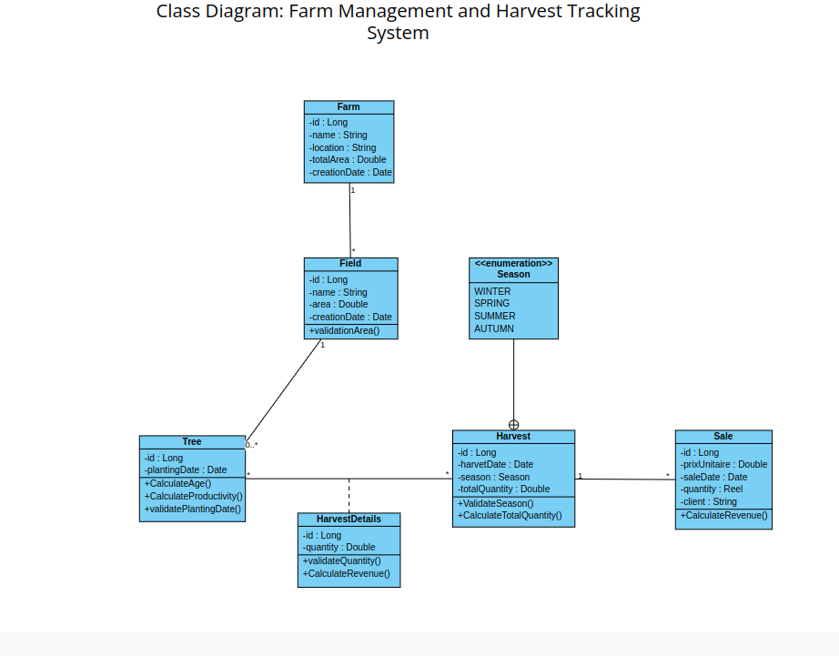

Here's the content formatted as a `.md` file that you can directly use. Just copy and paste this into your README.md file:

# 🍋 Citronix - Lemon Farm Management System

[](https://openjdk.java.net/projects/jdk/17/)
[](https://spring.io/projects/spring-boot)
[](LICENSE)

Citronix is a comprehensive farm management system designed specifically for lemon farms, enabling efficient tracking of production, harvesting, and sales processes.

## 📝 API Endpoints

### Farm Management

```http
GET     /api/v1/farms                # Get all farms
GET     /api/v1/farms/{id}           # Get farm by ID
POST    /api/v1/farms                # Create new farm
PUT     /api/v1/farms/{id}           # Update farm
DELETE  /api/v1/farms/{id}           # Delete farm
GET     /api/v1/farms/search         # Search farms by criteria

```

### API Documentation UI
- Swagger UI: `http://localhost:8080/swagger-ui/index.html`
- OpenAPI Spec: `http://localhost:8080/v3/api-docs`

## Class Diagram

## 🚀 Getting Started

### Prerequisites
- Java 17
- Maven
- Your favorite IDE (IntelliJ IDEA recommended)

### Installation Steps
1. Clone the repository:
```bash
git clone https://github.com/yourusername/Citronix.git
```

2. Navigate to the project directory:
```bash
cd Citronix
```

3. Build the project:
```bash
mvn clean install
```

4. Run the application:
```bash
mvn spring-boot:run
```
