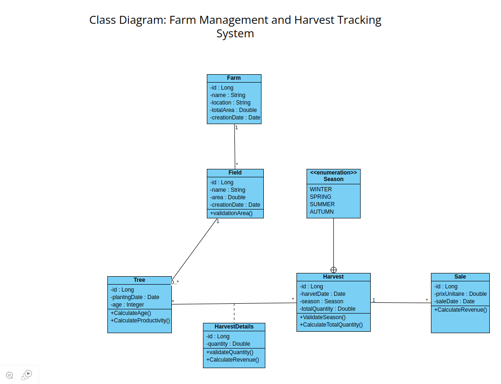

# 🍋 Citronix - Lemon Farm Management System

Citronix is a comprehensive farm management system designed specifically for lemon farms, enabling efficient tracking of production, harvesting, and sales processes.

## Class Diagram
