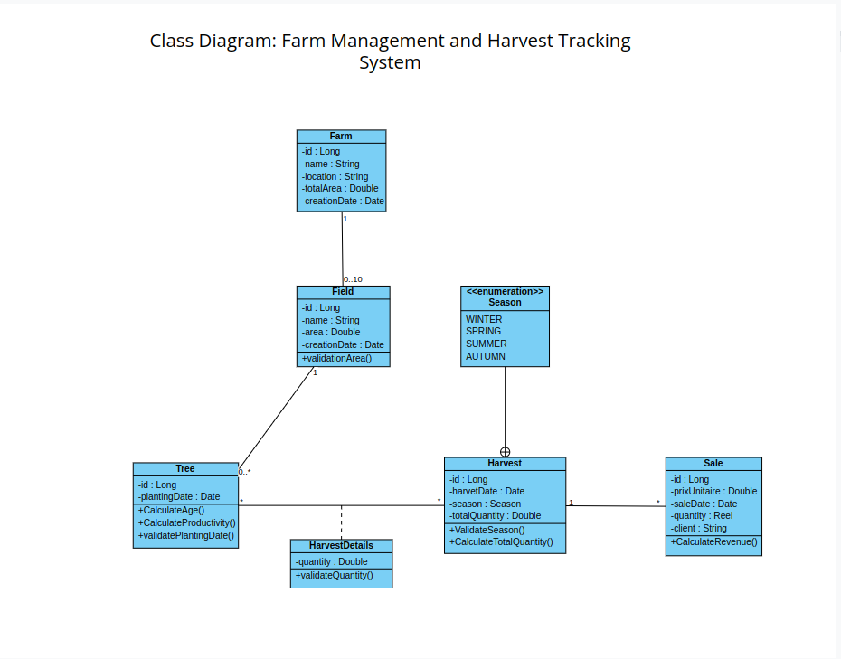

# 🍋 Citronix - Lemon Farm Management System

[](https://openjdk.java.net/projects/jdk/17/)
[](https://spring.io/projects/spring-boot)
[](LICENSE)

Citronix is a comprehensive farm management system designed specifically for lemon farms, enabling efficient tracking of production, harvesting, and sales processes.

## 📝 API Endpoints

### Farm Management

```http
GET     /api/v1/farms                # Get all farms
GET     /api/v1/farms/{id}           # Get farm by ID
POST    /api/v1/farms                # Create new farm
PUT     /api/v1/farms/{id}           # Update farm
DELETE  /api/v1/farms/{id}           # Delete farm
GET     /api/v1/farms/search         # Search farms by criteria
```

### Field Management

```http
GET     /api/v1/fields                # Get all fields
GET     /api/v1/fields/{id}           # Get field by ID
POST    /api/v1/fields                # Create new field
PUT     /api/v1/fields/{id}           # Update field
DELETE  /api/v1/fields/{id}           # Delete field
```
### Tree Management

```http
GET     /api/v1/trees                 # Get all trees
GET     /api/v1/trees/{id}            # Get tree by ID
POST    /api/v1/trees                 # Create new tree
PUT     /api/v1/trees/{id}            # Update tree
DELETE  /api/v1/trees/{id}            # Delete tree
```
### Harvest Management

```http
GET     /api/v1/harvests              # Get all harvests
GET     /api/v1/harvests/{id}         # Get harvest by ID
POST    /api/v1/harvests              # Create new harvest
PUT     /api/v1/harvests/{id}         # Update harvest
DELETE  /api/v1/harvests/{id}         # Delete harvest

```
### Harvest Details Management

```http
GET     /api/v1/harvest-details               # Get all harvest details
GET     /api/v1/harvest-details/{id}          # Get harvest details by ID
POST    /api/v1/harvest-details               # Create new harvest details
PUT     /api/v1/harvest-details/{harvestId}/{treeId}  # Update harvest details by harvestId and treeId
DELETE  /api/v1/harvest-details/{harvestId}/{treeId}  # Delete harvest details by harvestId and treeId

```


### API Documentation UI
- Swagger UI: `http://localhost:8080/swagger-ui/index.html`

## Class Diagram

## 🚀 Getting Started

### Prerequisites
- Java 17   
- Maven
- Your favorite IDE (IntelliJ IDEA recommended)

### Installation Steps
1. Clone the repository:
```bash
git clone https://github.com/yourusername/Citronix.git
```

2. Navigate to the project directory:
```bash
cd Citronix
```

3. Build the project:
```bash
mvn clean install
```

4. Run the application:
```bash
mvn spring-boot:run
```